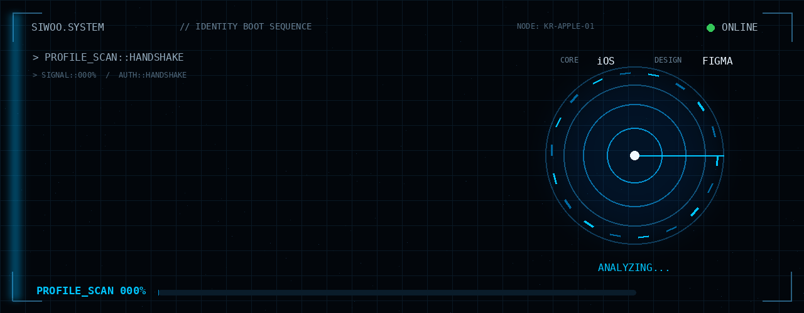
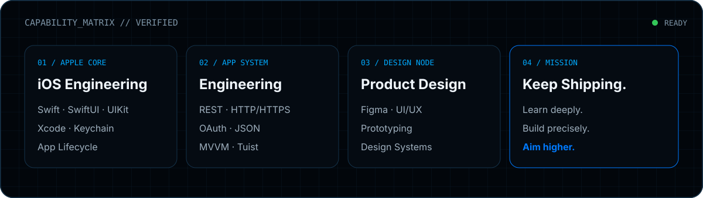
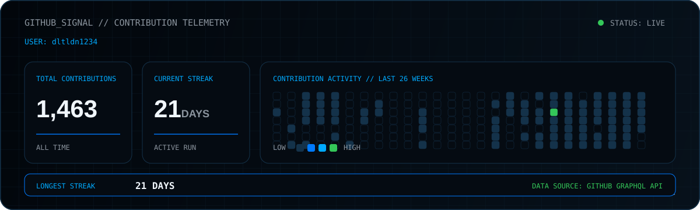
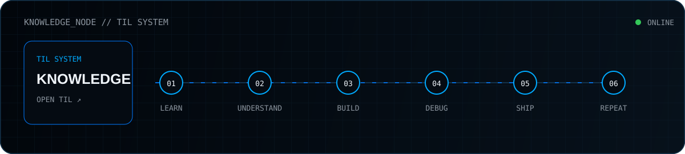
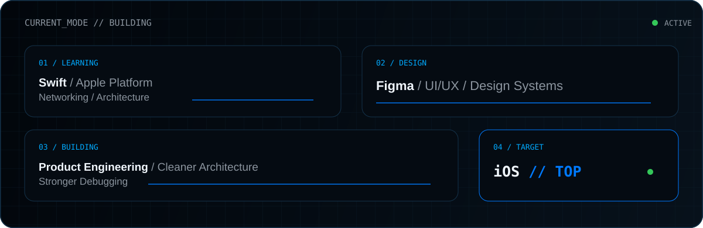

<p align="center">
  
</p>

<p align="center">
  <code>APPLE PLATFORM</code>&nbsp;&nbsp;
  <code>SWIFT</code>&nbsp;&nbsp;
  <code>SWIFTUI</code>&nbsp;&nbsp;
  <code>FIGMA</code>&nbsp;&nbsp;
  <code>BUILDING</code>
</p>

<br/>

## `IDENTITY // VERIFIED`

```swift
import SwiftUI

@MainActor
struct Siwoo: Developer {
    let platform = "iOS"
    let language = "Swift"
    let designTool = "Figma"

    var mission: String {
        "Understand deeply. Build precisely. Ship relentlessly."
    }

    func execute() async {
        while true {
            await learn()
            await build()
            await debug()
            await ship()
        }
    }
}
```

> I don't want to stop at making an app work.  
> I want to understand the platform deeply enough to build products from idea to App Store.

<br/>

<p align="center">
  
</p>

<br/>

## `TECH // SIGNAL`

<p align="center">
  
</p>

```text
APPLE_PLATFORM    Swift / SwiftUI / UIKit / Xcode
APP_ENGINEERING   REST / HTTP / HTTPS / OAuth / JSON / Keychain
ARCHITECTURE      MVVM / State Management / Modularization / Tuist
DESIGN            Figma / UI·UX / Prototyping / Design Systems
WEB               HTML / CSS / JavaScript / React
TOOLING           Git / GitHub / VS Code / Firebase / Python
```

<br/>

## `GITHUB // LIVE SIGNAL`

<p align="center">
  
</p>

<br/>

## `ACTIVITY // AUTO FEED`

<sub>SYS.ACTIVITY.LOG // GitHub Actions syncs every 6 hours.</sub>

<!-- ACTIVITY:START -->

<table>
<tr><td colspan="3"><sub>SYS.ACTIVITY.LOG // LIVE FEED</sub></td></tr>
<tr><td width="96"><code>⌁ PULL</code></td><td><a href="https://github.com/team-native/Book-on-iOS-v1"><strong>team-native/Book-on-iOS-v1</strong></a><br/><sub>Pull request</sub></td><td align="right"><sub>12h ago</sub></td></tr>
<tr><td width="96"><code>! ISSUE</code></td><td><a href="https://github.com/team-native/Book-on-iOS-v1/issues/134"><strong>team-native/Book-on-iOS-v1</strong></a><br/><sub>OPENED · 책 상세 화면 이전 버튼 동작 수정</sub></td><td align="right"><sub>12h ago</sub></td></tr>
<tr><td width="96"><code>⌁ PULL</code></td><td><a href="https://github.com/team-native/hopes-iOS-v1"><strong>team-native/hopes-iOS-v1</strong></a><br/><sub>Pull request</sub></td><td align="right"><sub>13h ago</sub></td></tr>
<tr><td width="96"><code>⌁ PULL</code></td><td><a href="https://github.com/team-native/hopes-iOS-v1"><strong>team-native/hopes-iOS-v1</strong></a><br/><sub>Pull request</sub></td><td align="right"><sub>13h ago</sub></td></tr>
<tr><td width="96"><code>⌁ PULL</code></td><td><a href="https://github.com/team-native/hopes-iOS-v1"><strong>team-native/hopes-iOS-v1</strong></a><br/><sub>Pull request</sub></td><td align="right"><sub>13h ago</sub></td></tr>
</table>

<!-- ACTIVITY:END -->

<br/>

## `KNOWLEDGE // LOG`

<p align="center">
  <a href="https://github.com/dltldn1234/TIL">
    
  </a>
</p>

<br/>

## `CURRENT // MODE`

<p align="center">
  
</p>

<br/>

<p align="center">
  
</p>
